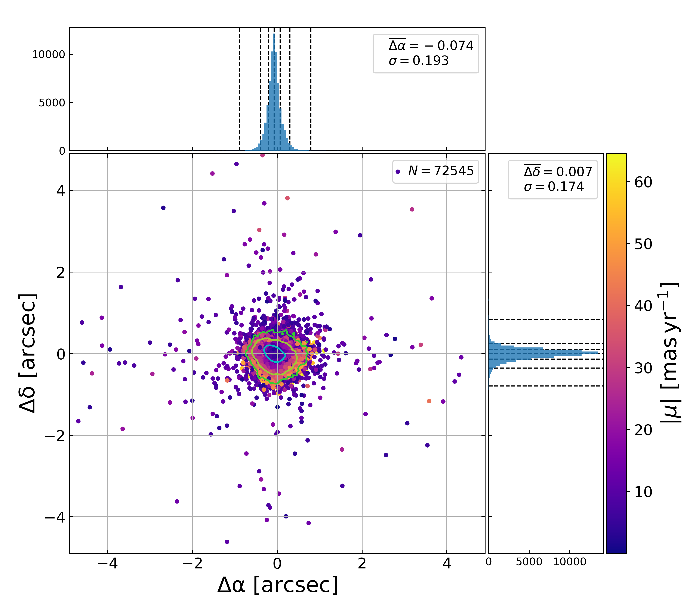

# splus-gaia-astrometry

This Python script calculates the differences between the astrometry (position measurements) from the S-PLUS photometric catalogue and Gaia DR2 or DR3 catalog. The S-PLUS catalogue must be provided, while Gaia is gotten via querying. The code then performs a cross-match between the sources to compare their positions. The results are presented in a figure that shows the difference between the astrometries.

## Requirements

The following external packages are required to run the `splus-gaia-astrometry.py` script:

- `astropy` (version 4.3.1): A powerful package for astronomy-related data manipulation and analysis.

- `astroquery` (version 0.4.3): A Python package for querying astronomical databases and web services.

- `colorlog` (version 5.0.1): A logging utility with colored output.

- `gitpython` (version 3.1.18): A Python library to interact with Git repositories.

- `matplotlib` (version 3.4.3): A widely used plotting library for creating high-quality visualizations.

- `numpy` (version 1.21.2): A fundamental package for scientific computing with Python.

- `pandas` (version 1.3.3): A library for data manipulation and analysis.

- `statspack` (version 0.1.2): A package providing statistical functions.

These dependencies can be installed using `pip` by running the following command:

```bash
pip install -r requirements.txt
```

Please make sure to install these dependencies before running the `splus-gaia-astrometry.py` script to ensure smooth execution.
## Usage

When using `splus-gaia-astrometry.py` script, the user shall provide the arguments through the command line. Below is a description of each argument:

```bash
python3 splus-gaia-astrometry.py -t list_of_tiles.txt -f tiles_new_status.csv -d astrocatalogs/ -ra ALPHA_J2000 -de DELTA_J2000 -c 2 -nc 4 --percents=[0.3,4.5,32] --savefig --contour
```

### Arguments:

- `-t`, `--tiles` (required): List of tiles to be processed.

- `-f`, `--footprint` (required): File containing the positions of the S-PLUS tiles.

- `-w`, `--workdir`: Work directory path. Default is the current directory.

- `-d`, `--datadir`: Data directory path. Default is the `workdir`.

- `-g`, `--gaia_dr`: Gaia catalogue number as registered at Vizier. Default is 355 (Gaia DR3).

- `-u`, `--hdu`: HDU number of the catalogue when the catalog is FITS format. Default is 1.

- `-ra`, `--racolumn`: Column name of the RA in the catalogue. Default is `RA`.

- `-de`, `--deccolumn`: Column name of the DEC in the catalogue. Default is `DEC`.

- `-m`, `--mag_column`: Column name of the magnitude in the catalogue. Default is `MAG_AUTO`.

- `-fl`, `--flags_column`: Column name of the flags in the catalogue. Default is `None`.

- `-cs`, `--clstar_column`: Column name of the clstar in the catalogue. Default is `None`.

- `-fwhm`, `--fwhm_column`: Column name of the FWHM (Full Width at Half Maximum) in the catalogue. Default is `None`.

- `-sn`, `--sn_column`: Column name of the signal-to-noise ratio in the catalogue. Default is `None`.

- `-a`, `--angle`: Radius to search Gaia sources around the tile center. Default is 1.0 degrees.

- `-sl`, `--sn_limit`: Signal-to-noise lower limit to be used in the cross-match. Default is 10.0.

- `-o`, `--output`: Output name of the stacked catalogue. Default is `results_stacked.csv`.

- `-b`, `--bins`: Number of bins in the histogram. Default is 1000.

- `-l`, `--limits`: Limit of the histogram. Default is 0.5.

- `-nc`, `--ncores`: Number of cores to be used. Default is 1.

- `--contour`: Plot the contour of the Probability Density Function (PDF). Default is False.

- `--colours`: Colors of the histograms. Default is `['limegreen', 'yellowgreen', 'c']`.

- `--percents`: Percentiles of the contours. Default is 3, 2, and 1 sigma, or `[0.3, 4.5, 32]`.

- `-sf`, `--savefig`: Save the figure. Default is False. If True, saves the figure named `results_staked.png`

- `--showfig`: Show the figure. Default is False.

- `--debug`: Prints out the debug information of the code. Default is False.

- `-vv`, `--verbose`: Prints out the progress of the code. Default is False.

- `--clobber`: Overwrite the output file. Default is False.

## Example

```bash
python3 splus-gaia-astrometry.py -t list_of_tiles.txt -f tiles_new_status.csv -d astrocatalogs/ -ra ALPHA_J2000 -de DELTA_J2000 -c 2 -nc 4 --percents=[0.3,4.5,32] --savefig --contour
```

The above command will process the specified S-PLUS tiles from the given footprint file and compare their astrometry with Gaia DR3. It will use 4 cores for processing and create a figure (`results_stacked.png`) showing the difference between the astrometries. The contours in the figure will represent the percentiles entered with the option `--percents`.


## Output

The script will generate a figure named after the `--output` option that displays the difference between the astrometries of S-PLUS and Gaia. The contours on the figure show the Probability Density Function, indicating the distribution of the astrometric differences.

## License

This code is distributed under the [GNU GENERAL PUBLIC LICENSE v3.0](LICENSE). Please refer to the `LICENSE` file in the repository for more details.

## Author

The script is authored by Fabio R Herpich and can be reached at fabio.herpich@ast.cam.ac.uk.

## Version

The current version of the script is indicated in the code. The latest version can be found on GitHub under the repository [herpichfr/splus-gaia-astrometry](https://github.com/herpichfr/splus-gaia-astrometry).

For any questions or issues related to the code, feel free to reach out to the author or open an issue on the GitHub repository.
